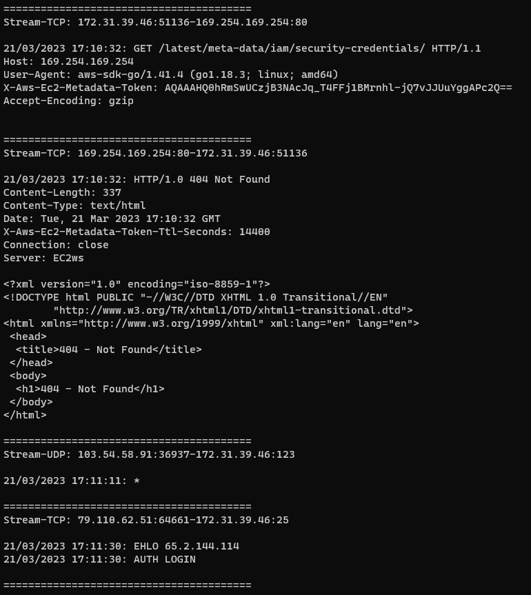
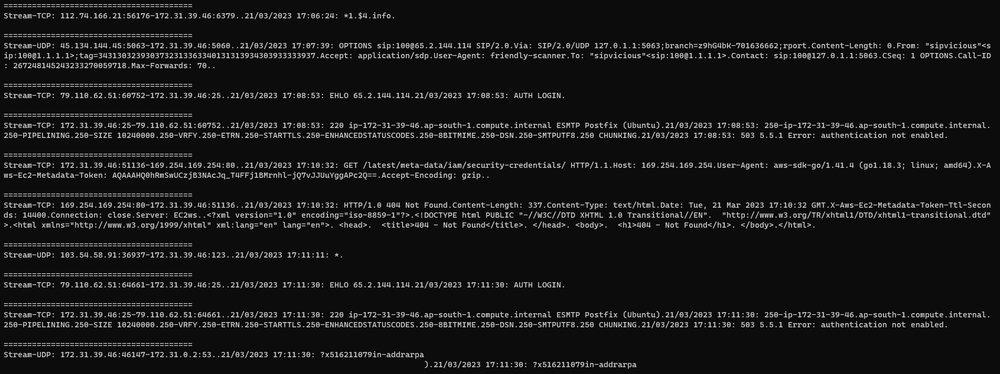
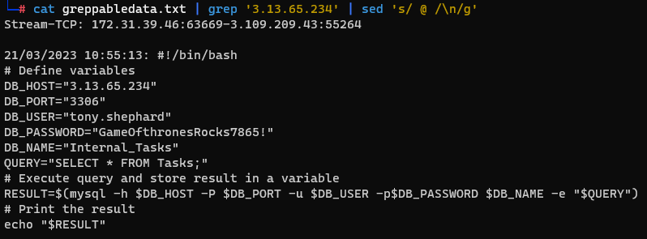

# PCAP_Parser

This Python script, `pcap_parser`, facilitates the extraction and parsing of TCP streams from a pcap (packet capture) file. It uses Scapy, an interactive packet manipulation tool, to handle the parsing of network packets.

## Prerequisites

- Python 3.x
- `scapy` library (`pip install scapy`)

## Usage

### Command-line Arguments

- `pcap_file`: Path to the input pcap file.
- `--dest-ip`: Destination IP address to filter packets (optional).
- `--output-file`: Output file to save the extracted TCP streams (optional).
- `--grep`: Outputs the data in a greppable format (optional).

### Example

    python3 pcap_parser.py my_capture.pcap --output-file extracted_streams.txt --grep

### Normal output

  

### Greppable output

  

## Note

The greppable output is what makes this script awesome. With it we can `grep` for a `timestamp`, an `source/destination IP address`, a `source/destination port` or `any data` in the body of the packets stream. Then we can format the data as needed. We just replace the text ` @ ` (`blank@blank`) by `\n` and we will restore the new lines on the packet stream to get a pretty nice output.

### Example

        cat greppabledata.txt | grep '127.0.0.1' | sed 's/ @ /\n/g'

  

## Functionality

The script employs Scapy to read a pcap file and extract TCP streams based on the specified or all destination IPs. It organizes these streams and prints/saves them, allowing for optional greppable formatting.

### How it Works

The script utilizes Scapy to iterate through the packets in the pcap file, extracting TCP packets based on given criteria such as source and destination IPs and ports. It then arranges these packets into their respective streams, maintaining packet data and timestamps in UTC format.

### Additional Notes

`The script processes TCP, UDP, and ICMP packets.
Timestamps are extracted and formatted in UTC time.
It filters packets based on the specified destination IP if provided.`

## Contributing

Feel free to contribute, open issues, or suggest improvements! Pull requests are welcomed.

## License

`This project is licensed under the MIT License - see the LICENSE file for details.`
